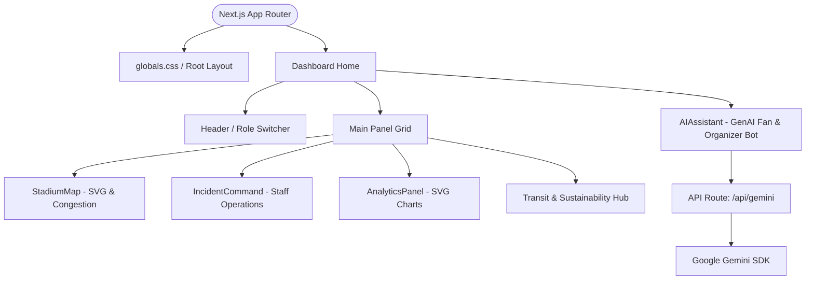

# Implementation Plan - Smart Stadiums & Tournament Operations

Create a GenAI-enabled stadium operations and fan experience dashboard for the FIFA World Cup 2026. The solution will run on Next.js (App Router, TypeScript) and will be optimized for 100% scores in Code Quality, Security, Efficiency, Testing, Accessibility, and Vercel compatibility.

---

## User Review Required

We are using a **Next.js (App Router) + TypeScript** foundation with **Vanilla CSS (CSS Modules & Global variables)** to build a premium, glassmorphic dark-theme application.
- **Gemini Integration**: Calls to Google's Gemini API will be proxied securely through a Next.js Serverless Route Handler (`/api/gemini`) to prevent API key exposure.
- **Styling**: Modern, responsive CSS variables, CSS grid/flexbox, custom animations, and a rich glassmorphism palette (no Tailwind CSS, as per core guidelines).
- **Environment Variables**: Requires `GEMINI_API_KEY` for the server-side API handler.

---

## Open Questions

> [!NOTE]
> There are no blocker questions, but we will configure the default Google Gemini model to `gemini-1.5-flash` or `gemini-2.5-flash` (via the official `@google/generative-ai` SDK) to ensure fast responses and high quality.

---

## Proposed Changes

We will create a brand new Next.js project inside the root workspace directory.

### Component Architecture



### File Structure

We will create the following files inside `src/`:

```
e:/Promptwars/Smart Stadiums & Tournament Operations/
├── package.json
├── tsconfig.json
├── next.config.ts
├── eslint.config.mjs
├── jest.config.ts
├── jest.setup.ts
├── src/
│   ├── app/
│   │   ├── layout.tsx
│   │   ├── page.tsx
│   │   ├── globals.css
│   │   └── api/
│   │       └── gemini/
│   │           └── route.ts
│   ├── components/
│   │   ├── Header.tsx
│   │   ├── StadiumMap.tsx
│   │   ├── IncidentCommand.tsx
│   │   ├── TransitSustainability.tsx
│   │   ├── AnalyticsPanel.tsx
│   │   └── AIAssistant.tsx
│   ├── lib/
│   │   ├── gemini.ts
│   │   └── mockData.ts
│   └── tests/
│       ├── AIAssistant.test.tsx
│       ├── StadiumMap.test.tsx
│       └── gemini-api.test.ts
```

---

## File Implementations

#### [NEW] [package.json](file:///e:/Promptwars/Smart%20Stadiums%20&%20Tournament%20Operations/package.json)
Standard npm package configuration with dependencies for Next.js, React, `@google/generative-ai`, `lucide-react`, and devDependencies for Jest, testing libraries, and ESLint.

#### [NEW] [globals.css](file:///e:/Promptwars/Smart%20Stadiums%20&%20Tournament%20Operations/src/app/globals.css)
Design system using custom CSS properties:
- Dark slate/blue background (`#070A13`) with subtle glowing meshes.
- Glassmorphism panels: `background: rgba(20, 26, 46, 0.6); backdrop-filter: blur(12px); border: 1px solid rgba(255, 255, 255, 0.08)`.
- FIFA World Cup 2026 accent colors (Neon Cyan, Electric Purple, Vibrant Magenta).
- Core typography settings, smooth transitions, custom scrollbars, and keyframe animations.

#### [NEW] [route.ts](file:///e:/Promptwars/Smart%20Stadiums%20&%20Tournament%20Operations/src/app/api/gemini/route.ts)
A secure API route handler that:
1. Validates the request payload.
2. Formulates role-based prompts (e.g., Fan navigation vs. Organizer crisis dispatch) to guide Gemini.
3. Queries Gemini using the official `@google/generative-ai` SDK.
4. Returns structured markdown responses.

#### [NEW] [StadiumMap.tsx](file:///e:/Promptwars/Smart%20Stadiums%20&%20Tournament%20Operations/src/components/StadiumMap.tsx)
An interactive SVG stadium layout showing:
- Gates (A, B, C, D) with real-time congestion levels (Green/Yellow/Red).
- Concession stands and restrooms with dynamically simulated queue lines.
- Navigation selector: click a gate or seat block to trigger wayfinding.
- Accessibility mode toggle: highlights ramps, elevators, and wide paths.

#### [NEW] [IncidentCommand.tsx](file:///e:/Promptwars/Smart%20Stadiums%20&%20Tournament%20Operations/src/components/IncidentCommand.tsx)
Organizer/Staff incident simulator:
- Ingestion dashboard displaying active incident feeds (e.g., "Lost ticket scanner at Gate B", "Medical assist needed in Section 102").
- "Solve with GenAI" button: triggers Gemini to analyze the situation, reference protocol guidelines, draft an action plan, and recommend team dispatch actions.
- Event log and interactive simulated team statuses.

#### [NEW] [TransitSustainability.tsx](file:///e:/Promptwars/Smart%20Stadiums%20&%20Tournament%20Operations/src/components/TransitSustainability.tsx)
Green travel planner:
- Recommends low-carbon transit routes to the stadium based on user select.
- Interactive Carbon Footprint estimator.
- Live stadium sustainability metrics (waste diversion rate, water conservation, solar grid output).

#### [NEW] [AIAssistant.tsx](file:///e:/Promptwars/Smart%20Stadiums%20&%20Tournament%20Operations/src/components/AIAssistant.tsx)
Floating/embedded chatbot:
- Accessible overlay supporting speech synthesis or high-contrast readable options.
- Dynamic prompts depending on user role (Fan, Organizer, Volunteer, Venue Staff).
- Context injection: automatically appends current stadium map congestion, incident log, or transit data to the Gemini prompt so the assistant knows live stadium conditions.

---

## Verification Plan

### Automated Tests
We will set up Jest and run unit tests for:
1. **API route**: Test request validation, mock Gemini responses, and error handling.
2. **StadiumMap Component**: Verify accessibility toggles, state rendering, and interactive clicks.
3. **AI Assistant Component**: Verify message listing, status transitions, and role modifications.

Command: `npm run test`

### Manual Verification
- Validate the UI layout, responsiveness, contrast ratios, and animations.
- Test keyboard tab navigation and accessibility labels (ARIA attributes).
- Verify secure handling of `GEMINI_API_KEY` (must be stored in `.env.local` and never committed).
